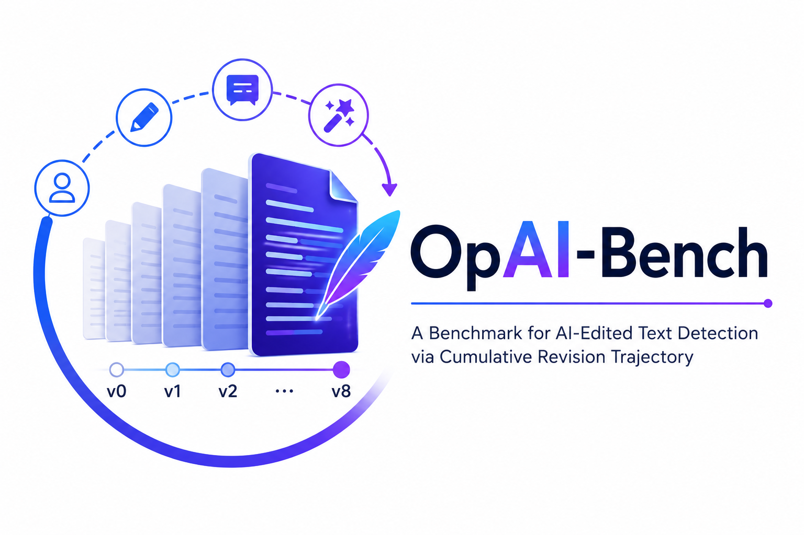
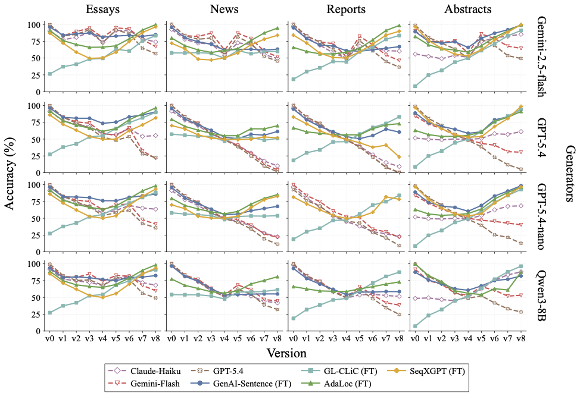

<p align="center">
  
</p>
<p align="center">
  <b>Operation-Guided Progressive Human-to-AI Text Transformation Benchmark<br>
  for Multi-Granularity AI-Text Detection</b>
</p>

<p align="center">
  <a href="https://scholar.google.com/citations?user=m10_qBQAAAAJ&hl=en"><strong>Sondos Mahmoud Bsharat</strong></a>&emsp;
  <a href="https://scholar.google.com/citations?hl=en&user=_awln6YAAAAJ"><strong>Jiacheng Liu</strong></a>&emsp;
  <a href="https://scholar.google.com/citations?user=PliLuD4AAAAJ&hl=en"><strong>Xiaohan Zhao</strong></a>&emsp;
  <a href="https://scholar.google.com/citations?user=JlUDjukAAAAJ&hl=en"><strong>Tianjun Yao</strong></a>&emsp;
  <a href="https://shangxinyi.github.io/"><strong>Xinyi Shang</strong></a>&emsp;
  <a href="https://github.com/TangentOne"><strong>Yi Tang</strong></a>
</p>

<p align="center">
  <a href="https://jiachengcui.com/"><strong>Jiacheng Cui</strong></a>&emsp;
  <a href="https://www.linkedin.com/in/ahmed-adel-elhagry/"><strong>Ahmed Elhagry</strong></a>&emsp;
  <a href="https://scholar.google.com/citations?user=TWtF0CAAAAAJ&hl=en"><strong>Salwa K. Al Khatib</strong></a>&emsp;
  <a href="https://www.hao-li.com/Hao_Li/Hao_Li_-_about_me.html"><strong>Hao Li</strong></a>&emsp;
  <a href="https://salman-h-khan.github.io/"><strong>Salman Khan</strong></a>&emsp;
  <a href="https://zhiqiangshen.com/"><strong>Zhiqiang Shen</strong></a><sup>†</sup>
</p>

<p align="center">
  <sub>
    <sup>†</sup> Corresponding author
  </sub>
</p>

<br>

<p align="center">
  <a href="https://arxiv.org/abs/2606.06481">
    
  </a>
  &nbsp;
  <a href="https://huggingface.co/datasets/OpAI-Bench1/OpAI-Bench">
    
  </a>
  &nbsp;
  <a href="./LICENSE">
    
  </a>
</p>

<p align="center">
  
  
  
  
  
  
</p>

<br>

<p align="center">
  <b>OpAI-Bench</b> is a benchmark for evaluating AI-text detection under progressive human–AI co-editing, where AI revisions are introduced gradually into selected parts of a human-written document and tracked with document-, sentence-, token-, and span-level provenance.
</p>

---

## 🎯 Overview

Real-world writing is increasingly produced through **progressive human-AI co-editing**: a human draft may be polished, paraphrased, compressed, expanded, or stylistically rewritten by an AI assistant over multiple revision rounds. However, most AI-text detection benchmarks focus on static endpoint texts, treating documents as either fully human-written or fully AI-generated.

**OpAI-Bench** addresses this limitation by constructing **operation-guided human-to-AI revision trajectories**. Starting from human-written source documents, each sample is expanded into a **nine-version trajectory** from `v0` to `v8`, where AI-edited coverage increases progressively while different edit operations are applied.


<p align="center">
  
</p>


Each document is first segmented into sentences. A deterministic shuffle order is then created using the document identifier as the seed. At each revision stage, OpAI-Bench selects the first `k%` of sentences from this fixed order, ensuring that the edited sentence set grows cumulatively:

`S⁽⁰⁾ ⊆ S⁽¹⁾ ⊆ ... ⊆ S⁽⁸⁾`

This design makes the benchmark reproducible, trajectory-aware, and suitable for analyzing how AI-authorship signals emerge, accumulate, or disappear across revision stages.

---

## 🔄 Cumulative Revision Trajectory

OpAI-Bench represents AI-assisted writing as a **progressive human-to-AI revision trajectory**, not a single endpoint classification.

**Key design choices:**

* **Nine ordered versions:** each document is expanded from `v0` to `v8`.
* **Human source:** `v0` is the original fully human-written document.
* **Controlled AI coverage:** later versions introduce AI edits at predefined sentence-level ratios.
* **Deterministic selection:** edited sentences are selected using a document-specific fixed shuffle order.
* **Cumulative editing:** once a sentence is selected, it remains in the AI-edited set in later versions.
* **Multi-granularity provenance:** AI involvement is tracked at document, sentence, token, and span levels.

| Version | Edit Operation | AI Sentence Coverage |
| :-----: | -------------- | :------------------: |
|   `v0`  | None           |          0%          |
|   `v1`  | Polish         |          15%         |
|   `v2`  | Paraphrase     |          25%         |
|   `v3`  | Style rewrite  |          40%         |
|   `v4`  | Compress       |          50%         |
|   `v5`  | Expand         |          60%         |
|   `v6`  | Style rewrite  |          75%         |
|   `v7`  | Paraphrase     |          90%         |
|   `v8`  | Polish         |         100%         |


---

## 📈 Benchmark Statistics

OpAI-Bench contains **15,722** human-written source documents, expanded into **31,089** generator-specific revision trajectories and **279,794** versioned samples across four writing domains.

| Domain               | Source Docs (`v0`) | Revision Trajectories | Versioned Samples (`v0`–`v8`) | Avg. Sentences | Avg. Tokens |
| :------------------- | -----------------: | --------------------: | ----------------------------: | -------------: | ----------: |
| Student essays       |              3,969 |                 7,906 |                        71,154 |           21.0 |       398.8 |
| News articles        |              3,998 |                 7,892 |                        71,028 |           24.0 |       491.3 |
| Government reports   |              3,993 |                 8,000 |                        72,000 |           20.6 |       563.7 |
| Scientific abstracts |              3,762 |                 7,291 |                        65,612 |           11.0 |       234.3 |
| **Total**            |         **15,722** |            **31,089** |                   **279,794** |       **19.3** |   **426.1** |

**Notes.** Source documents are distinct human-written `v0` texts. Revision trajectories are generator-specific editing sequences initialized from `v0`. Versioned samples count the released texts along the full revision path from `v0` to `v8`.

The main benchmark split uses **GPT-5.4**, **GPT-5.4-nano**, and **Gemini 2.5 Flash**. **Qwen3-8B** is reserved as a held-out generator for cross-generator evaluation.

---

## 🚀 Quick Start

### Installation

```bash
git clone https://github.com/<ORG>/OpAI-Bench.git
cd OpAI-Bench

pip install -r requirements.txt
```

### Load the Dataset

```python
from datasets import load_dataset

ds = load_dataset("OpAI-Bench1/OpAI-Bench")
print(ds)
```

### Export a Split to CSV

```python
from datasets import load_dataset

test_ds = load_dataset("OpAI-Bench1/OpAI-Bench", split="test")
test_ds.to_csv("opaibench_test.csv")
```

### Generate New Trajectories

```bash id="v7zxmx"
python construction/build_opaibench.py \
    --input_csv data/input.csv \
    --output_csv outputs/opaibench.csv \
    --id_column id \
    --text_column text
```

The construction pipeline supports multiple LLM providers, including OpenAI, Gemini, DeepSeek, and Hugging Face Inference APIs.


---

## 🔍 Evaluation

OpAI-Bench supports evaluation across document, sentence, token, and span granularities. The benchmark evaluates detectors under three regimes:

1. **Zero-shot detectors** evaluated without exposure to OpAI-Bench.
2. **LLM-as-detector baselines** prompted to classify sentence-level authorship.
3. **OpAI-Bench-trained detectors** fine-tuned on the training split and evaluated on in-distribution and held-out generators.

### Evaluated Detector Families

| Granularity            | Detectors                                                                                      |
| ---------------------- | ---------------------------------------------------------------------------------------------- |
| **Document-level**     | Desklib, DetectLLM, E5-Small, Fast-DetectGPT, OOD-LLM-Detect, RADAR, RoBERTa-OpenAI, GigaCheck |
| **Sentence-level**     | AdaLoc, GenAI-Sentence, GL-CLiC, SeqXGPT, GPT-5.4, Gemini 3 Flash, Claude Haiku 4.5            |
| **Token / Span-level** | DAMASHA, GigaCheck                                                                             |

Metrics include **accuracy** and **AI-class F1**, reported across versions, domains, generators, and edit operations.

### Quick Evaluation

```bash
uv sync

export HF_DATASET=OpAI-Bench1/OpAI-Bench

# Smoke test
uv run python eval.py detector=e5-small max_samples=20 \
    dataset.hf_repo=$HF_DATASET

# Full evaluation
uv run python eval.py detector=e5-small \
    dataset.hf_repo=$HF_DATASET
```

For detector-specific checkpoints and local model setup, see `CHECKPOINTS.md`.

Common overrides:

```bash
uv run python eval.py detector=fast-detectgpt dataset.split=dev
uv run python eval.py -m detector=e5-small,desklib,fast-detectgpt
```

Outputs are written to `results/` and include predictions, aggregate metrics, and a reproducible run configuration snapshot.


---

## 🏆 Key Findings

OpAI-Bench reveals that AI-text detectability is **not monotonic** with AI coverage.

> Mixed-authorship intermediate versions can be harder to detect than both fully human and heavily AI-edited endpoints.

In particular, the benchmark identifies a difficult mixed-authorship region around **`v4`**, where **50% AI coverage** coincides with **compression**. This suggests that reliable AI-text detection requires moving beyond static human-vs-AI endpoint classification toward **trajectory-aware** and **operation-aware** evaluation.


<br>
<p align="center">
  
</p>
<p align="center">
  <sub>
    Sentence-level detection accuracy across revision versions, domains, and generators. Mixed-authorship intermediate versions consistently emerge as the most challenging stage, highlighting the non-monotonic nature of AI-text detectability.
  </sub>
</p>

---

## 📁 Repository Structure

```bash
OpAI-Bench/
├── construction/           # Benchmark construction pipeline
├── conf/                   # Hydra configurations
├── src/                    # Core benchmark utilities
├── opai_bench_detectors/   # Unified detector wrappers
├── baseline/               # Upstream detector implementations
├── training/               # Fine-tuning scripts
├── scripts/                # Utility and helper scripts
├── assets/                 # Figures used in the paper
├── eval.py                 # Main evaluation entry point
├── CHECKPOINTS.md          # Detector checkpoint setup
├── THIRD_PARTY_NOTICES.md
├── pyproject.toml
├── LICENSE
└── README.md
```

---
## 📖 Citation

If you find OpAI-Bench useful in your research, please cite:

```bibtex
@article{bsharat2026opaibench,
  title = {Operation-Guided Progressive Human-to-AI Text Transformation Benchmark for Multi-Granularity AI-Text Detection},
  author = {Bsharat, Sondos Mahmoud and Liu, Jiacheng and Zhao, Xiaohan and Yao, Tianjun and Shang, Xinyi and Tang, Yi and Cui, Jiacheng and Elhagry, Ahmed and Al Khatib, Salwa K. and Li, Hao and Khan, Salman and Shen, Zhiqiang},
  journal = {arXiv preprint arXiv:XXXX.XXXXX},
  year = {2026}
}
```


